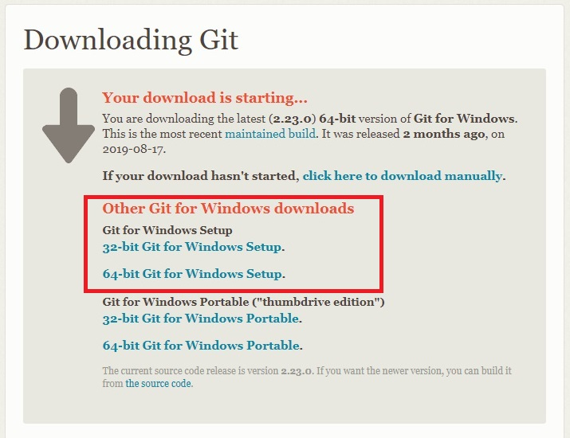
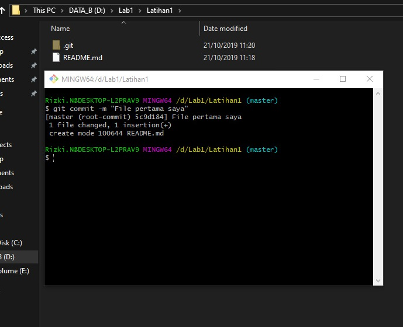
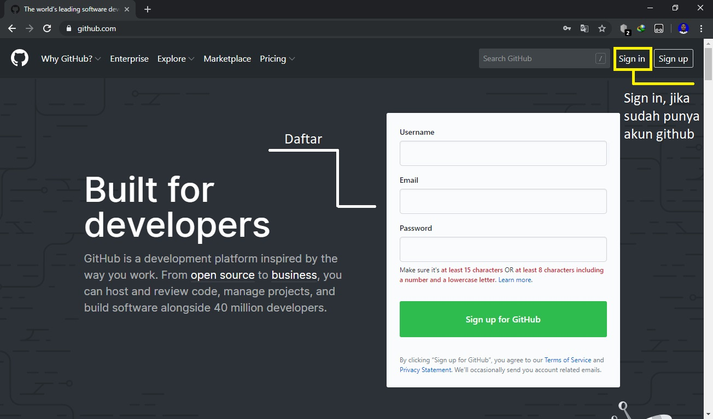

# 
.::Tutorial penggunaan git::.
 

A.Installasi Git

	1.Pertama anda download aplikasi gitnya di (git-scm.com). (Screenshot 1)
	2.Klik download for windows. (Screenshot 1)
	3.Unduh git sesuai arsitektur komputer 32bit atau 64bit. (Screenshot 2)
	4.Buka File installasi Git di folder Download. (Screenshot 3)
	5.dan Install seperti biasa. (Screenshot 4)
	6.Cek git sudah terinstall atau belum dengan cara, buka CMD atau PowerShell. (Screenshot 5)
	  kemudian ketikan perintah "git --version" tanpa kutip. (Screenshot 6)

B.Menambahkan Global Config 

	1.Buka CMD
	2.Ketikan " git config --global user.name nama_user " tanpa kutip. (Screenshot 7)
	3.Ketikan " git config --global user.email nama_email " tanpa kutip. (Screenshot 7)

C.Membuat Repository Local

	1.Buat atau Buka Folder di Windows Explorer. (Screenshot 8)
	2.Klik kanan pada Folder tersebut, dan pilih menu Git Bash, sehingga muncul git bash command. (Screenshot 9)
	3.Buat direktori project praktikum pertama dengan nama Latihan1. (Screenshot 10)
		a.Ketikan "mkdir Latihan1" tanpa kutip, agar terbentuk satu direktori baru di bawahnya. (Screenshot 10)
		b.Ketikan "cd Latihan1" tanpa kutip, untuk masuk ke direktori Latihan1. (Screenshot 11)
	
D.Membuat Repository Local

	1.Ketikan perintah "git init" di Git Bash, untuk membuat Repository Local. (Screenshot 12)
	2.Akan terbentuk file hidden bernama .git, yang menandakan repository berhasil di inisialisasi. (Screenshot 13)
	3.Pada direktori tersebut, semua perubahan pada working directory akan disimpan
	
E.Menambahkan File Baru Pada Repository

	1.Anda bisa membuat file nya menggunakan text editor lalu menyimpan filenya pada repository,
	  atau lanjut menggunakan Git Bash, tutorial ini akan menggunakan Git Bash
	2.Buat file README.md, ketikan (echo "#Latihan 1" >> README.md) tanpa kurung  
	  File README.md berhasil dibuat dan bisa di edit. (Screenshot 13)  
	3.Masukan perintah "git add README.md" tanpa tanda kutip. (Screenshot 14)

F.Commit(Menyimpan Perubahan Ke Database)

	1.Gunakan perintah (git commit -m "File pertama saya") tanpa kurung, 
	  untuk menyimpan perubahan kedalam database repository local. (Screenshot 15)

G.Membuat Repository Server

	1.Buka browser lalu masuk ke web http://github.com
	2.Jika belum punya akun silahkan daftar, jika sudah punya langsung Sign in saja. (Screenshot 16 & 17)
	3.Pada laman beranda github anda, klik start a project atau dari menu (icon +) klik New Repository. (Screenshot 18)
	4.Isi nama repositorynya: Latihan1. (Screenshot 19)
	5.Lalu klik tombol Create Repository. (Screenshot 19)
	
H.Menambahkan Remote Repository

	1.Buka Repository Server Latihan1. 
	2.Copy alamat repositorynya. (Screenshot 20)
	3.Buka Git Bash nya lagi, kemudian jalankan perintah "git remote add origin [URL]" tanpa kutip. (Screenshot 21)

I.Push(Mengirim Perubahan Ke Server)

	1.Jalankan perintah git push "git push -u origin master" tanpa kutip. (Screenshot 22 & 23)
	2.Anda akan di minta memasukan username & password pada akun github.com.
	3.Jika sukses, kita lihat hasil nya pada repository server.
	4.Buka laman github.com arahkan pada repository Latihan1. (Screenshot 24)
	5.Maka perubahan akan terlihat. (Screenshot 24)

J.Clone Repository

	1.Gunakan perintah git clone "git clone [URL]" tanpa kutip. (Screenshot 25)

:::Rizki Nurdiansyah::: 

:::____311910155____::: 

:::_____TI.19.D.2_____::: 

<strong>Screenshot 1</strong> 
 
<strong>Screenshot 2</strong> 
 
<strong>Screenshot 3</strong> 
 
<strong>Screenshot 4</strong> 
 
<strong>Screenshot 5</strong> 
 
<strong>Screenshot 6</strong> 
 
<strong>Screenshot 7</strong> 
 
<strong>Screenshot 8</strong> 
  
<strong>Screenshot 9</strong> 
 
<strong>Screenshot 10</strong> 
 
<strong>Screenshot 11</strong> 
 
<strong>Screenshot 12</strong> 
 
<strong>Screenshot 13</strong> 
 
<strong>Screenshot 14</strong> 
 
<strong>Screenshot 15</strong> 
 
<strong>Screenshot 16</strong> 
 
<strong>Screenshot 17</strong> 
 
<strong>Screenshot 18</strong> 
 
<strong>Screenshot 19</strong> 
 
<strong>Screenshot 20</strong> 
 
<strong>Screenshot 21</strong> 
 
<strong>Screenshot 22</strong> 
 
<strong>Screenshot 23</strong> 
 
<strong>Screenshot 24</strong> 
 
<strong>Screenshot 25</strong> 
 
